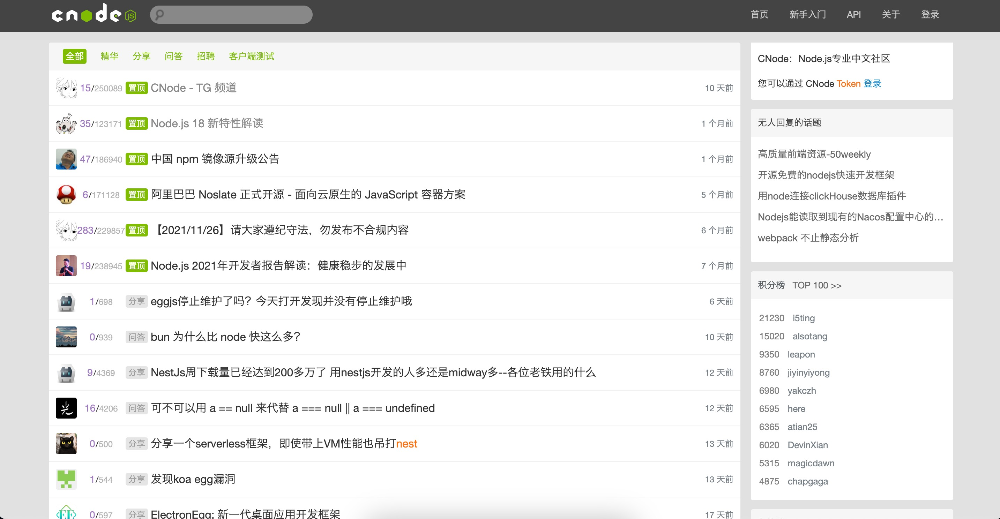

<p align="center">
  
  

</p>

<p align="center">

<a href="https://vercel.com/savoygu/nuxt-cnode/deployments">

</a>
</p>

<p align="center">基于 Nuxt3 构建 CNode 社区</p>



## 功能

- [x] 主题
  - [x] 主题首页
  - [x] 主题详情
  - [x] 新建主题
  - [x] 编辑主题
- [x] 主题收藏
  - [x] 收藏主题
  - [x] 取消主题
  - [x] 用户所收藏的主题
- [x] 评论
  - [x] 新建评论
  - [x] 为评论点赞
- [x] 用户
  - [x] Access Token 登录
  - [x] 用户详情
- [x] 消息通知
  - [x] 获取已读和未读消息
  - [x] 获取未读消息数
  - [ ] 标记全部已读
  - [ ] 标记单个消息为已读

## 开发

克隆和安装：

```bash
git clone git@github.com:savoygu/nuxt-cnode
cd nuxt-cnode
npm i
```

运行开发服务器：

```bash
npm run dev
```

构建用于生产的应用程序:

```bash
npm run build
```

本地预览生产版本:

```bash
npm run preview
```

## 项目部署

[Vercel](https://vercel.com/dashboard)

## 贡献者

<!-- ALL-CONTRIBUTORS-LIST:START - Do not remove or modify this section -->
<!-- prettier-ignore-start -->
<!-- markdownlint-disable -->

<!-- markdownlint-restore -->
<!-- prettier-ignore-end -->

<!-- ALL-CONTRIBUTORS-LIST:END -->
